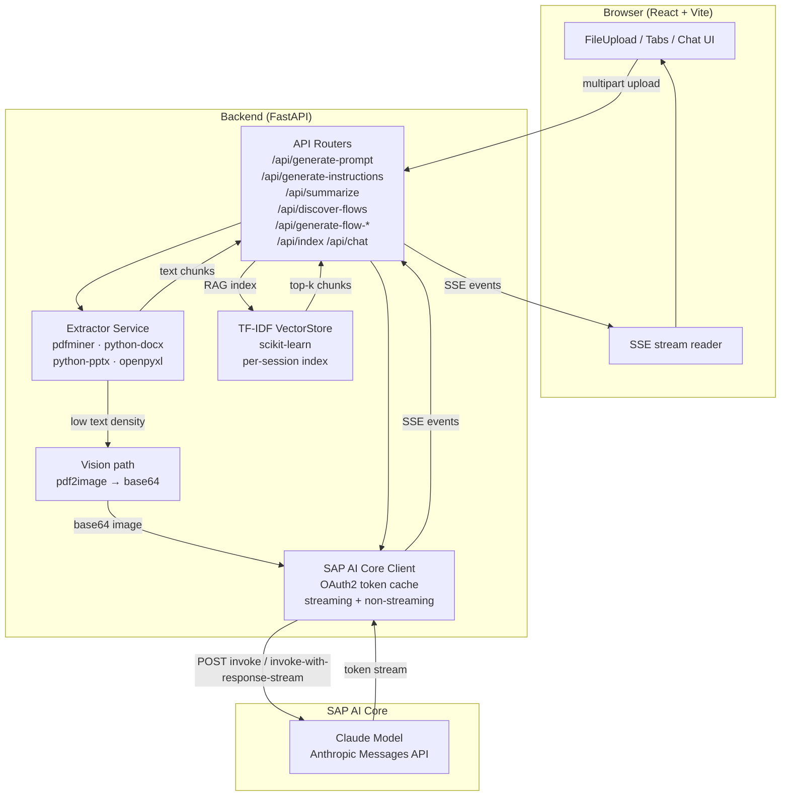
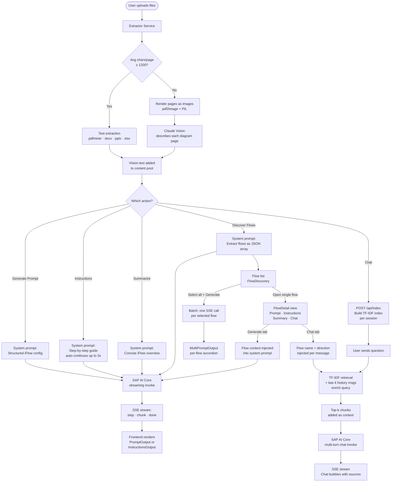

# Orbit — SAP CPI iFlow Prompt Generator

Upload your integration documents and get instant AI-generated outputs: a ready-to-use SAP CPI iFlow configuration prompt, a step-by-step build guide, a concise summary, or just chat with your documents. Powered by **Claude on SAP AI Core**.

---

## Features

| Feature | Description |
|---|---|
| **Generate Prompt** | Structured iFlow configuration prompt — topology, component config, adapter settings — ready to paste into the iFlow builder |
| **Instructions** | Full manual build guide with exact UI steps, Groovy/XSLT/JSONata scripts, and Postman + cURL tests. Auto-continues if the response hits the token limit |
| **Summarize** | Concise iFlow overview — name/purpose, topology, adapters & protocols table, key config, gotchas |
| **Discover Flows** | Scans all uploaded documents and extracts every integration interface as a structured list |
| **Per-flow detail view** | For any discovered iFlow, generate a scoped Prompt, Instructions, Summary, or open a chat tab focused on that specific flow |
| **Multi-flow batch** | Select multiple discovered flows and generate prompts for all of them in one click |
| **RAG Chat** | Ask questions about your documents. Full multi-turn conversation history, TF-IDF retrieval, and Claude Vision support for diagram PDFs |
| **Export** | Download any output as TXT, Word (.docx), or PDF |
| **Session history** | Last 5 generated outputs saved to localStorage and restorable in one click |

---

## Flow Diagram

### System Architecture



### Request Flow — From Upload to Output



---

## Quick Start

### Recommended (Windows)

```powershell
.\dev.ps1
```

Kills any stale processes on ports 8000 and 5173, then starts both servers in separate windows.

### Manual

```bash
# Copy env and fill in SAP AI Core credentials
cp .env.example .env

# Install Python dependencies
pip install -e .

# Backend
uvicorn main:app --reload --port 8000

# Frontend (separate terminal)
cd frontend && npm install && npm run dev
```

- Backend API: `http://localhost:8000`
- Frontend UI: `http://localhost:5173`
- Swagger docs: `http://localhost:8000/docs`

---

## Technical Stack

### Backend

| Layer | Technology | Purpose |
|---|---|---|
| Web framework | **FastAPI** 0.115 | Async API, dependency injection, OpenAPI docs |
| ASGI server | **Uvicorn** | Hot-reload in dev; production server on BTP |
| Streaming | **Server-Sent Events (SSE)** | Token-by-token streaming from Claude to the browser |
| PDF text | **pdfminer.six** | High-fidelity text extraction from PDF pages |
| PDF images | **pdf2image + Pillow** | Renders low-text PDFs as images for Claude Vision |
| Word docs | **python-docx** | Paragraph and table text extraction from `.docx` |
| PowerPoint | **python-pptx** | Slide text extraction from `.pptx` |
| Spreadsheets | **openpyxl / xlrd** | Cell text extraction from `.xlsx` / `.xls` |
| RAG retrieval | **scikit-learn TF-IDF** | Per-session document index; no external vector DB needed |
| HTTP client | **httpx** (async) | Streaming and non-streaming calls to SAP AI Core |
| Auth | **OAuth2 client credentials** | Token cached in memory, refreshed 30 s before expiry |
| Python version | **Python 3.13** | Managed via `pyproject.toml` with `uv` or `pip` |

### SAP AI Core / LLM

| Detail | Value |
|---|---|
| Platform | SAP AI Core (Generative AI Hub) |
| Model | Claude (Anthropic) — `claude-sonnet` family |
| API format | Anthropic Messages API (`anthropic_version: bedrock-2023-05-31`) |
| Invocation | `/v2/inference/deployments/{id}/invoke` (sync) and `invoke-with-response-stream` (SSE) |
| Max tokens | Up to 8 192 per call; Instructions auto-continues up to 3× for large iFlows |
| Vision | Base64-encoded images sent in the `image` content block for diagram-heavy PDFs |

### Frontend

| Layer | Technology | Purpose |
|---|---|---|
| UI framework | **React 18** | Component tree, hooks-based state management |
| Build tool | **Vite 6** | Dev server with HMR; proxies `/api/*` to `localhost:8000` |
| Styling | **CSS Modules** | Scoped styles; dark/light theme via `data-theme` on `<html>` |
| Icons | **Lucide React** | Consistent SVG icon set throughout the UI |
| Font | **Lexend** (Google Fonts) | Readable variable-weight sans-serif |
| Export — Word | **docx.js** | Client-side `.docx` generation |
| Export — PDF | **jsPDF** | Client-side PDF generation |
| Markdown render | Custom inline renderer | Bold, inline code, tables, paragraphs in chat bubbles |
| Persistence | **localStorage** | Last 5 generated outputs, dark-mode preference |

### Document Intelligence

| Capability | How it works |
|---|---|
| **Adaptive extraction** | If avg chars/page < 1 200, the PDF is rendered as images — catches diagram-heavy integration specs that have little extractable text |
| **Claude Vision** | Each rendered page is sent to Claude with an SAP-specific Vision prompt that extracts iFlow names, adapter types, endpoints, and business objects verbatim |
| **TF-IDF RAG** | On `/api/index`, all text chunks are vectorized with scikit-learn TF-IDF. The session index lives in memory — no database required |
| **Query enrichment** | On `/api/chat`, the user's question is enriched with the last 4 conversation messages before TF-IDF retrieval, so follow-up questions like "tell me more about that flow" retrieve the right chunks |
| **Multi-turn chat** | The full `messages` array is forwarded to Claude on every turn — pronouns and references to earlier answers resolve correctly |
| **Flow focus injection** | When generating for a discovered flow, the flow's name, direction, source/target, and description are prepended to the user content block before calling Claude |

---

## API Endpoints

### Document generation

| Endpoint | Method | Input | Description |
|---|---|---|---|
| `/api/generate-prompt` | POST | `files[]` | Structured iFlow config prompt |
| `/api/generate-instructions` | POST | `files[]` | Step-by-step build guide (auto-continues) |
| `/api/summarize` | POST | `files[]` | Concise iFlow overview |
| `/api/discover-flows` | POST | `files[]` | Extract all integration interfaces as JSON |
| `/api/generate-flow-prompt` | POST | `files[]` + `flow_json` | Prompt scoped to one flow |
| `/api/generate-flow-instructions` | POST | `files[]` + `flow_json` | Instructions scoped to one flow |
| `/api/generate-flow-summary` | POST | `files[]` + `flow_json` | Summary scoped to one flow |

### Chat

| Endpoint | Method | Input | Description |
|---|---|---|---|
| `/api/index` | POST | `files[]` | Index files into a TF-IDF session; returns `session_id` |
| `/api/chat` | POST | JSON body | Multi-turn chat with RAG retrieval |

### SSE event format

All generation and chat endpoints respond with an SSE stream. Each line is `data: <json>`.

| `status` | Payload | Meaning |
|---|---|---|
| `step` | `{ key, message }` | Progress update (extract, vision, generate, retry…) |
| `step_done` | `{ key, message }` | Step completed |
| `chunk` | `{ text }` | Streaming token from Claude |
| `done` | `{ prompt, warning?, flows?, session_id? }` | Final output |
| `error` | `{ message }` | Error description |

---

## Supported file types

| Format | Extensions |
|---|---|
| PDF | `.pdf` |
| Word | `.docx`, `.doc` |
| PowerPoint | `.pptx` |
| Excel | `.xlsx`, `.xls` |
| CSV | `.csv` |
| Plain text | `.txt` |
| API specs | `.json`, `.yaml`, `.yml` |
| Service definitions | `.xml`, `.wsdl` |
| Images | `.png`, `.jpg`, `.jpeg`, `.webp`, `.gif` |

---

## Environment variables

| Variable | Description |
|---|---|
| `AICORE_CLIENT_ID` | OAuth2 client ID from SAP AI Core service key |
| `AICORE_CLIENT_SECRET` | OAuth2 client secret |
| `AICORE_AUTH_URL` | Token endpoint base URL |
| `AICORE_BASE_URL` | AI Core API base URL (includes `/v2`) |
| `AICORE_RESOURCE_GROUP` | Resource group (default: `default`) |
| `LLM_DEPLOYMENT_ID` | Claude deployment ID in SAP AI Core |
| `LLM_TIMEOUT` | LLM request timeout in seconds (default: `120`) |
| `CORS_ORIGINS` | Comma-separated allowed CORS origins (default: `http://localhost:5173`) |
| `LLM_USAGE_MONITOR_BASE_URL` | Usage monitor service URL (omit to disable) |
| `LLM_USAGE_MONITOR_APP_ID` | App ID for the usage monitor |
| `LLM_USAGE_MONITOR_MODEL_NAME` | Model name reported to the monitor |
| `LLM_USAGE_MONITOR_API_KEY` | Bearer token for the usage monitor |

---

## Project structure

```
main.py                          FastAPI entry — CORS, routers, health check, static SPA
app/
  routers/
    prompt.py                    Generation + discovery endpoints; SSE streaming logic
    chat.py                      /api/index and /api/chat; TF-IDF RAG + Vision indexing
  services/
    extractor.py                 File → text or base64 image; adaptive PDF mode
    aicore.py                    SAP AI Core OAuth2 token cache + streaming/sync calls
    vectorstore.py               TF-IDF document store (build, search, per-session)
    embedder.py                  Vision description pipeline (pdf2image → Claude Vision)
    validator.py                 Prompt structure validation before returning to UI
  monitoring/
    llm_monitor.py               Fire-and-forget usage reporting after every LLM call

frontend/src/
  App.jsx                        Top-level state, streaming orchestration, tab management
  components/
    FileUpload.jsx               Drag-and-drop multi-file upload with type chips
    PromptOutput.jsx             Code block display with Copy and Export
    InstructionsOutput.jsx       Formatted renderer (headings, bullets, tables) + export
    FlowDiscovery.jsx            Discovered flow list with checkboxes and Open button
    FlowDetail.jsx               Per-flow detail — Prompt / Instructions / Summary / Chat
    Chat.jsx                     RAG chat UI — indexing, bubbles, multi-turn history
    MultiPromptOutput.jsx        Accordion of per-flow generated prompts
    ExportMenu.jsx               TXT / DOCX / PDF export dropdown
    ProgressSteps.jsx            Animated step timeline during generation
    HelpModal.jsx                Keyboard shortcut and feature reference modal
    Toast.jsx                    Transient success / info / error notifications
  hooks/
    useToast.js                  Toast queue manager
  utils/
    exportUtils.js               TXT, DOCX (docx.js), and PDF (jsPDF) export logic
```

---

## Deploying to SAP BTP Cloud Foundry

### Prerequisites

- SAP BAS workspace with CF CLI logged in: `cf login -a <api> -o <org> -s <space>`

### Step 1 — Build the frontend

```bash
cd frontend && npm install && npm run build && cd ..
```

### Step 2 — Set environment variables

```bash
cf set-env orbit-prompt-creator AICORE_CLIENT_ID     <value>
cf set-env orbit-prompt-creator AICORE_CLIENT_SECRET <value>
cf set-env orbit-prompt-creator AICORE_AUTH_URL      <value>
cf set-env orbit-prompt-creator AICORE_BASE_URL      <value>
cf set-env orbit-prompt-creator LLM_DEPLOYMENT_ID    <value>
```

### Step 3 — Deploy

```bash
cf push
```

`manifest.yml` configures the Python buildpack, starts uvicorn on `$PORT`, and serves `frontend/dist/` as the SPA root.

### Re-deploy after changes

```bash
git pull origin master
cd frontend && npm install && npm run build && cd ..
cf push
```

### Troubleshooting

| Problem | Fix |
|---|---|
| `npm install` peer dependency error | Handled by `frontend/.npmrc` — run plain `npm install` |
| `frontend/dist/` missing after push | Run `npm run build` before `cf push` |
| App starts but returns 500 | Check `cf logs orbit-prompt-creator --recent` for missing env vars |
| CF push fails with memory error | Increase `memory` in `manifest.yml` (e.g. `768M`) |
| Auth errors in UI | Re-run `cf set-env` then `cf restage orbit-prompt-creator` |
